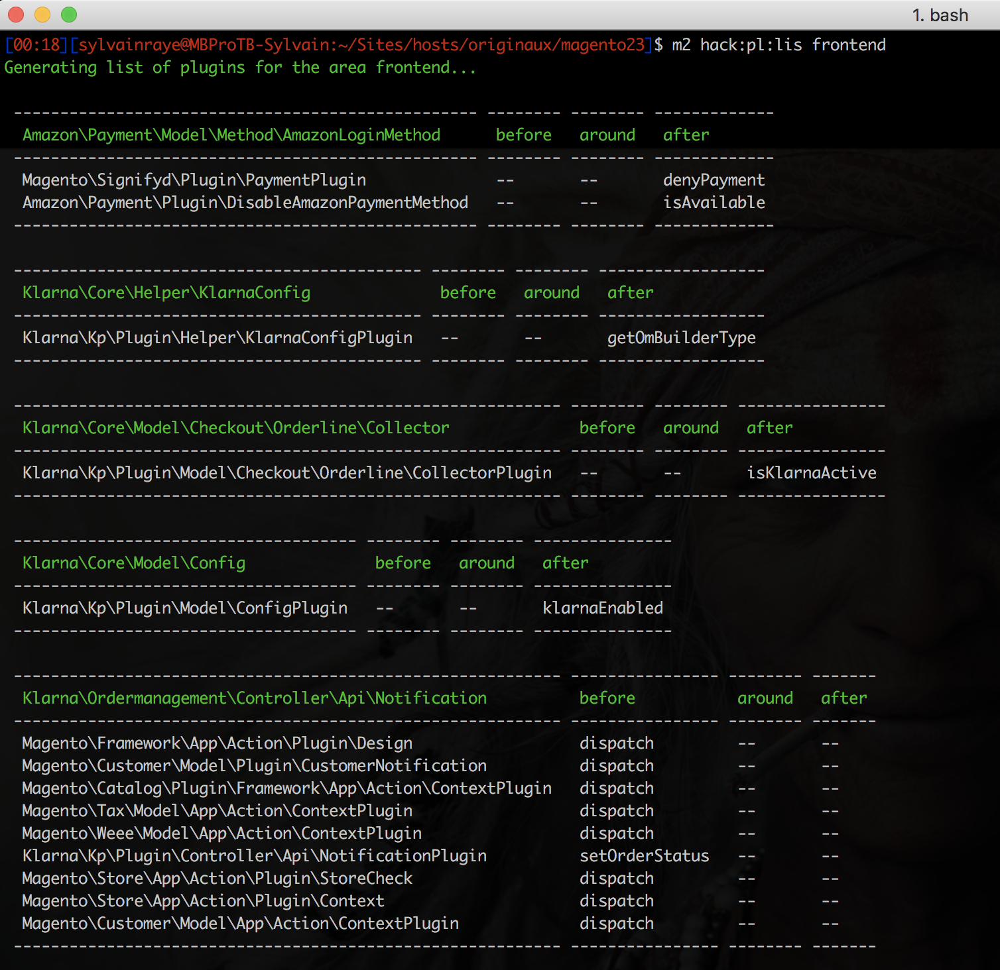

# CLI Plugin List for Magento 2

Get a good overview of plugins installed and be aware about their influence on your Magento 2 instance.

# Features list
- Get the list of plugins registered
- Get a list per area: global, frontend, adminhtml, webapi_rest, webapi_soap
- Get a list per module
- Detect easily in which way a plugin interfere with a method (before, around, after)

# Installation
This package is not yet hosted on GitHub. To use it, add the repository to your composer configuration:

`composer config repositories.cli-plugin-list vcs git@github.com:magento-hackathon/cli-plugin-list.git`

Next, install the extension using composer:

`composer require --dev magentohackathon/clipluginlist`

Next, enable the extension

`bin/magento module:enable MagentoHackathon_CliPluginList`

# Usage

`bin/magento hackathon:plugin:list frontend`

You can replace the area `frontend` with `adminhtml`, `webapi_rest`, `webapi_soap`.
By default, `global` is used. In any case, global plugins are always displayed.

By adding the option `-m, --module[=MODULE]` you can filter the results for one module only.

# License

OSL v3.0

# Author

- Torben Höhn
- Sylvain Rayé
- Matthias Hamacher
